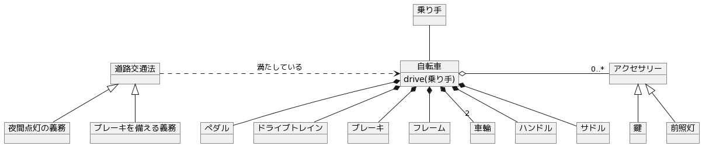

## 自転車

日本で一般に使用される二輪の[自転車](https://ja.wikipedia.org/wiki/%E8%87%AA%E8%BB%A2%E8%BB%8A)のモデル。

## モデル

## メモ

一般に使用される自転車だと道路交通法によりブレーキや夜間向けの装備が必要となる。
一方ピストバイクなどの競技用の自転車はブレーキが無かったりするので、ただの自転車としてモデリングすると最低限のパーツになりそう。

**ふたつの車輪を前後に一直線に並べた構造**を表現するのに車輪の部分は工夫できそう。その場合、前輪と後輪の型によっても構造が変わりそう。例えば前後で交換可能かどうか。
