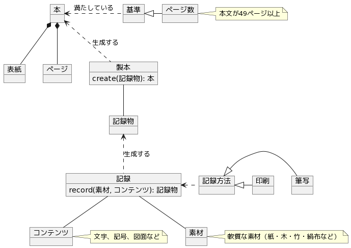

## 本

[本](https://ja.wikipedia.org/wiki/%E6%9C%AC)のモデル。巻物のようなものは含まず、片面を綴じてページをめくることで読むものをイメージ。

## モデル

## メモ

**記録**について、手で書くものを含めたので印刷ではなくこちらを選択した。知識や知見といったイメージを含めなければ単純に書く（write）のような用語が適しているかもしれない。

**記録物**について、製本前のモノを示す適当な用語が見つからなかった。

**ページ数**の基準はユネスコ総会のもので、どの程度適用されているのかは不明。他にも基準はあるかもしれない。
