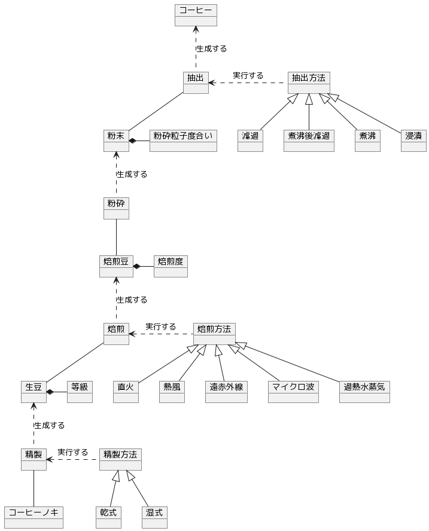

## コーヒー

[コーヒー](https://ja.wikipedia.org/wiki/%E3%82%B3%E3%83%BC%E3%83%92%E3%83%BC)の中でも、コーヒーの粉から抽出するレギュラーコーヒーのモデル。

## モデル

## メモ

コーヒーの粉末には一種類の焙煎豆のみからなる**ストレート**と、数種類を混合した**ブレンド**があるが、それが表現できていない。また**ブレンド**の混合タイミングが焙煎前の**プレミックス**と焙煎後の**アフターミックス**があるので、加工の手順を表現する必要がある。
