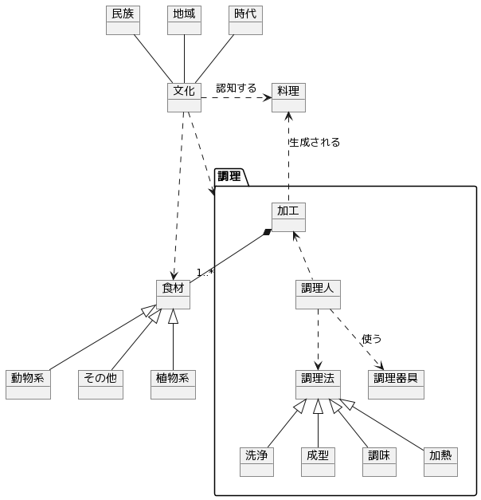

## 料理

[料理](https://ja.wikipedia.org/wiki/%E6%96%99%E7%90%86)のモデル。

### モデル

### メモ

**民族**、**地域**、**時代**を**文化**として抽出。**文化**によって**食材**や**調理**が異なり、また**料理**と認知されるかどうかも異なる。

**民族**は狩猟や農耕などの生活様式や宗教など、**地域**は手に入る食材や寒暖など、**時代**は調理法や調理器具の技術に関係しそう。
