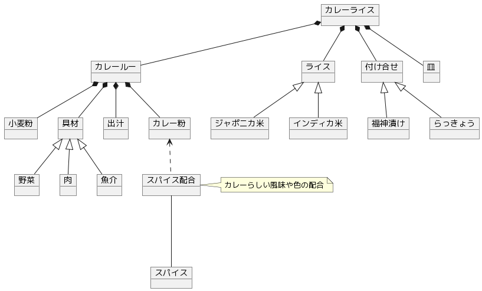

# カレーライス

カレー（curry）の中で、[カレーライス](https://ja.wikipedia.org/wiki/%E3%82%AB%E3%83%AC%E3%83%BC%E3%83%A9%E3%82%A4%E3%82%B9)や[日本のカレー](https://ja.wikipedia.org/wiki/%E6%97%A5%E6%9C%AC%E3%81%AE%E3%82%AB%E3%83%AC%E3%83%BC)と呼ばれるモノ。

## モデル

## 考察

特徴であるスパイスは風味や色など**カレーらしさ**が求められるので、「スパイス配合」によってそれが満たされた「カレー粉」が作成されるのではないか。

皿への盛り付けについても、カレーならではのルールがあるかもしれない。
