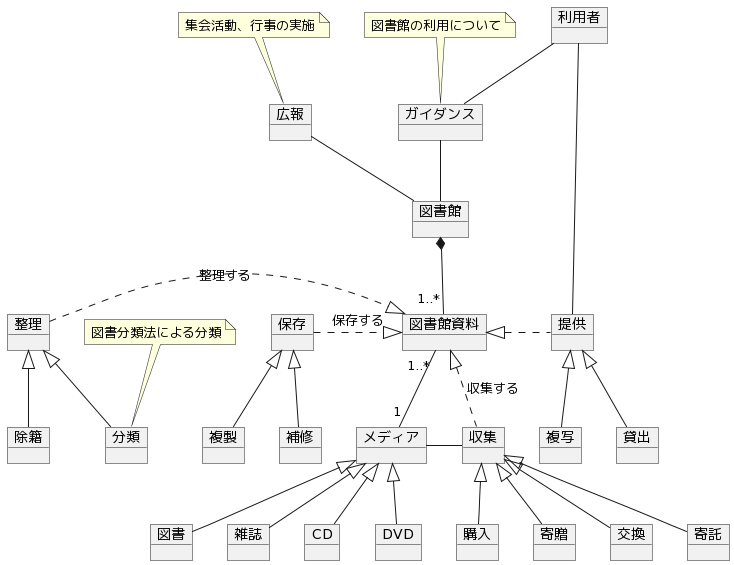

## 図書館

[図書館](https://ja.wikipedia.org/wiki/%E5%9B%B3%E6%9B%B8%E9%A4%A8)の機能についてのモデル。

- 図書館資料の収集
- 図書館資料の整理
- 図書館資料の保存
- 図書館資料の提供
- 集会活動、行事の実施
- 資料及び図書館利用に関する指導

### モデル

### メモ

収集は各図書館における収集方針と基準に沿った選択が行われる。

図書館には種類がある。（設置者別、サービス対象別、所蔵資料別など）
