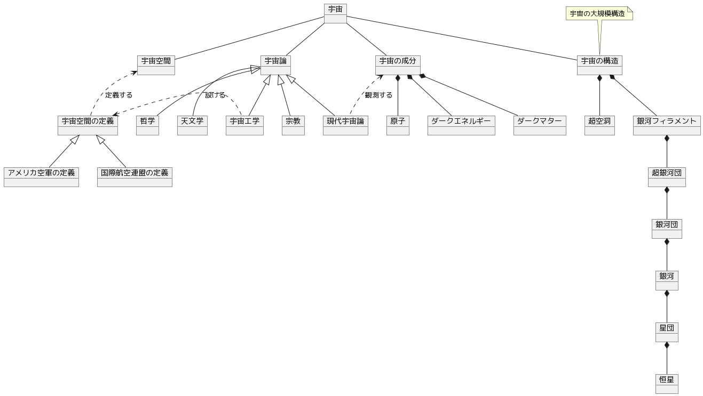

## 宇宙

[宇宙](https://ja.wikipedia.org/wiki/%E5%AE%87%E5%AE%99)のモデル。

### モデル

### メモ

宇宙という語はcosmos, universe、spaceの訳語でそれぞれ意味するところが異なる。英語としてuniverseとしているが、それよりも広い範囲のモデルになっている。（例えば**宇宙空間の定義**はspace）

